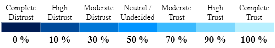
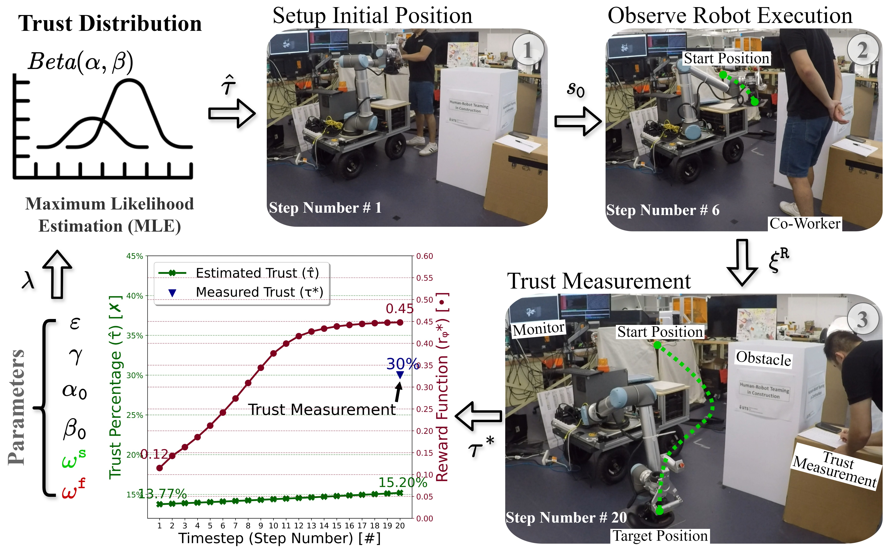

# Robot Learning of Human Trust
A codebase of journal paper "Robot Learning of Human Trust with A Continuous Beta Reputation in Human-Robot Collaboration" submission to IEEE Robotics and Automation Letters (RA-L) 2024.

---
## [Paper]() | [Code](https://github.com/resuldagdanov/robot-learning-human-trust) | [ArXiv]() | [Slide](https://github.com/resuldagdanov/robot-learning-human-trust/tree/main/presentation/slides) | [Video](https://youtu.be/qJnhyp-dHg0) | [Presentation](https://youtu.be/qJnhyp-dHg0) | <a href="src/README.md">ReadMe</a>

---
## Teaser
<figure>
    <p align="center">
        
    </p>
    <figcaption style="text-align: center; font-style: italic;">Figure 1: Teaser of the Proposed Framework</figcaption>
</figure>

---
## General Framework
<figure>
    <p align="center">
        
    </p>
    <figcaption style="text-align: center; font-style: italic;">Figure 2: General Framework</figcaption>
</figure>

---
## Citation
```bibtex
@INPROCEEDINGS{dagdanov2024trust,
}
```

---
## Follow <a href="src/README.md">ReadMe</a> File for Experiments and Source Code

---
## Autonomous Tiling with Collaborative Robot
<figure>
    <p align="center">
        
    </p>
    <figcaption style="text-align: center; font-style: italic;">Video 1: Robot Executing Tiling Operation Autonomously after Learning from Demonstrations</figcaption>
</figure>


---
## Human Trust Measurement
<figure>
    <p align="center">
        
    </p>
    <figcaption style="text-align: center; font-style: italic;">Figure 3: Measurement of Human Trust Toward a Robot (7-point Likert Scale)</figcaption>
</figure>

---
## Methodology
<figure>
    <p align="center">
        
    </p>
    <figcaption style="text-align: center; font-style: italic;">Figure 4: Illustration of an Iterative Human Trust Modeling Process (Proposed Framework)</figcaption>
</figure>

---
## Data Collection Process
<figure>
    <p align="center">
        
    </p>
    <figcaption style="text-align: center; font-style: italic;">Figure 5: Data Collection by Human Demonstrator in <a href="https://www.uts.edu.au/research/robotics-institute">UTS Robotics Institute</a> Lab Environment</figcaption>
</figure>

---
## Reward Function with Maximum-Entropy Optimization
<figure>
    <p align="center">
        
    </p>
    <figcaption style="text-align: center; font-style: italic;">Video 2: Visualization of Robot Decision-Making Policy in ROS Simulation Environment during IRL Optimization</figcaption>
</figure>

---
## Modeling Trust with Optimized Reward Function
<figure>
    <p align="center">
        
    </p>
    <figcaption style="text-align: center; font-style: italic;">Video 3: Reward and Trust Estimation Values during Inference Experiment #2 (4x speed-up) <a href="https://youtu.be/qJnhyp-dHg0">[Full Video]</a>
    </figcaption>
</figure>

<figure>
    <p align="center">
        <iframe width="640" height="360" src="https://www.youtube.com/embed/qJnhyp-dHg0" frameborder="0" allowfullscreen></iframe>
    </p>
    <figcaption style="text-align: center; font-style: italic;">Video 4: Short Illustration (1 minute) of 3 Stages of the Proposed Framework <a href="https://youtu.be/qJnhyp-dHg0">[YouTube Video]</a>
    </figcaption>
</figure>