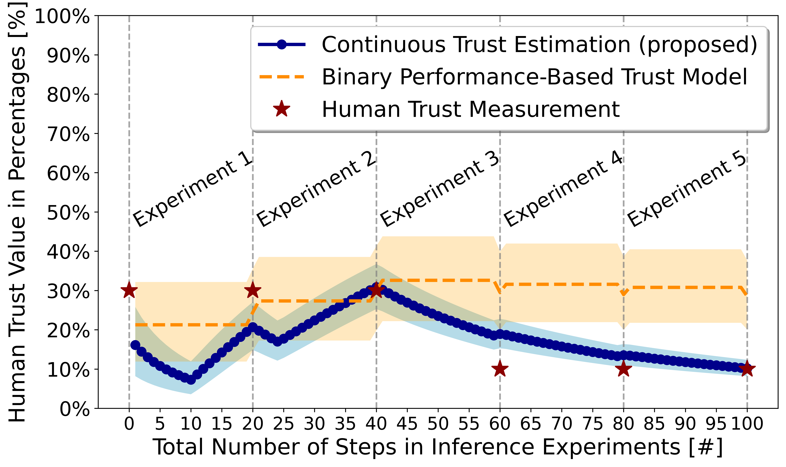

# Contents
* [Installation](#installation)
    - [Anaconda Environment Creation](#anaconda-environment-creation)
    - [Package Installation](#package-installation)
* [Environment](#environment)
* [Experiments](#installation)
    - [Dataset Analysis](#dataset-analysis)
    - [Model Training](#model-training)
    - [Model Evaluation](#model-evaluation)
* [Methodology](#methodology)
* [Results](#results)

---
# Installation

## Anaconda Environment Creation
> Requires Python >= 3.10:
* `conda create -y -n trust_learning python=3.10`
* `conda activate trust_learning`

## Package Installation
> Execute setup from the source code root of the repository:
* `cd src`
* `pip install -e .`

---
# Environment
> A markov decision process (MDP) environment script is located in the following directory:
* `cd src/environment`
<figure>
    

        
    

    <figcaption style="text-align: center; font-style: italic;">Figure 1: Environment of Tiling Operation with Cobot (@ UTS - Robotics Institute)</figcaption>
</figure>

---
# Experiments
<figure>
    

        
    

    <figcaption style="text-align: center; font-style: italic;">Figure 2: Environment of Human-Robot Teaming in Construction (@ UTS - Robotics Institute)</figcaption>
</figure>
<figure>
    

        
    

    <figcaption style="text-align: center; font-style: italic;">Figure 3: Human Demonstration Data Collection Process</figcaption>
</figure>

## Dataset Analysis
> Priorly collected dataset is shared in the repository:
* `cd dataset/human_demonstrations`
<figure>
    

        
    

    <figcaption style="text-align: center; font-style: italic;">Figure 4: Human Collected Training Dataset of 43 Trajectories (Expert Demonstrations)</figcaption>
</figure>

> The dataset is analyzed in the following notebook:
* `cd src/analyses`
* `jupyter notebook`
* `visualize_demonstration.ipynb`
<figure>
    

        
    

    <figcaption style="text-align: center; font-style: italic;">Figure 5: Visualization of One Trajectory of Human Operation (Expert Demonstration)</figcaption>
</figure>

## Model Training
> Neural network model files are located in the following directory:
* `cd src/models`

> To run the training script:
* `cd src/optimization`
* `python train.py`

> To run the training of the policy model (explicitly):
* `cd src/optimization`
* `python train_policy.py`

> To run the training of the reward model (explicitly):
* `cd src/optimization`
* `python train_reward.py`

## Model Evaluation
> The evaluation of the trained models is included in the following notebook:
* `cd src/evaluation`
* `jupyter notebook`
* `evaluate_trust_behavior.ipynb`
<figure>
    

        
    

    <figcaption style="text-align: center; font-style: italic;">Figure 6: Parameter Optimization during Learning Trust Behavior after Each Experiment</figcaption>
</figure>

> A Beta Reputation System implementation script is located in the following directory:
* `cd src/trusts`
* `model_dynamics.py`

---
# Methodology
<figure>
    

        
    

    <figcaption style="text-align: center; font-style: italic;">Figure 7: Illustration of an Iterative Trust Estimation Process (Proposed Framework)</figcaption>
</figure>

---
# Results
> Visualize the results of the Modeled Trust Behavior in the following notebook:
* `cd src/evaluation`
* `jupyter notebook`
* `visualize_trust_dynamics.ipynb`
<figure>
    

        
    

    <figcaption style="text-align: center; font-style: italic;">Figure 8: Comparing Trust Estimation with Trust Measurement in Testing Stage Experiments</figcaption>
</figure>
<figure>
    

        
    

    <figcaption style="text-align: center; font-style: italic;">Figure 8: Reward Function and Probabilistic Trust Behavior in the Testing Stage Experiments</figcaption>
</figure>